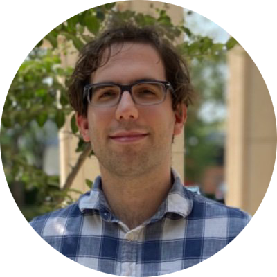

Hello, I’m Max. I have a BA in Physics and Geology from Carleton College and I'm currently a PhD student at Vanderbilt University in the [Department of Biostatistics](https://www.vumc.org/biostatistics/vanderbilt-department-biostatistics). Currently I'm conducting research on Bayesian clinical trials designs for COVID-19 with [Dr. Frank Harrell](https://www.fharrell.com), and I'm a statistician on the [ACTIV-6 trial](https://activ6study.org).

## About me
I worked as an ORISE Fellow from 2018-2020 in the [FDA Division of Antivirals](https://www.fda.gov/about-fda/center-drug-evaluation-and-research-cder/office-infectious-diseases-oid) (Office of New Drugs), where I built natural-language processing tools for product label data, and conducted meta-analyses of clinical trials for [hepatitis C](https://doi.org/10.1016/j.cgh.2020.08.042) and [HIV](https://www.croiconference.org/abstract/investigation-of-a-potential-composite-endpoint-for-immunologic-nonresponder-trials/) treatments. My interests are in adaptive clinical trial design, reproducible research, and statistics education.

In addition to my work at the FDA, I have conducted research with the LIGO collaboration on the effects of [magnetic transients on gravitational wave detection](https://doi.org/10.1088/1361-6382/aa60eb), studied the effects of [atmospheric noise on seismometers](https://doi.org/10.1785/0220160193) at the Albuquerque Seismological Laboratory, and worked in science policy at the [MIT Washington Office](https://dc.mit.edu) in Washington, DC.

Communicating science is as important as research to me. The past few years I have been working as a [tutor](https://prep1on1.com/our-team/), where I love teaching physics, chemistry, and mathematics to high-school and undergraduate students

In my free time I enjoy cooking (and collecting cookbooks), playing funk guitar, and swimming.

## Contact
You can contact me at <a href="mailto:maxdrohde@gmail.com">maxdrohde@gmail.com</a>. I also post on [Twitter](https://twitter.com/max_d_rohde).

My GitHub can here found [here](https://github.com/maxdrohde). I mainly code in R and Python, and I'm starting to learn to code in Julia.

You can find my publications at my Google Scholar page <a href="https://scholar.google.com/citations?user=nAFvhkEAAAAJ&hl=en">here</a>.